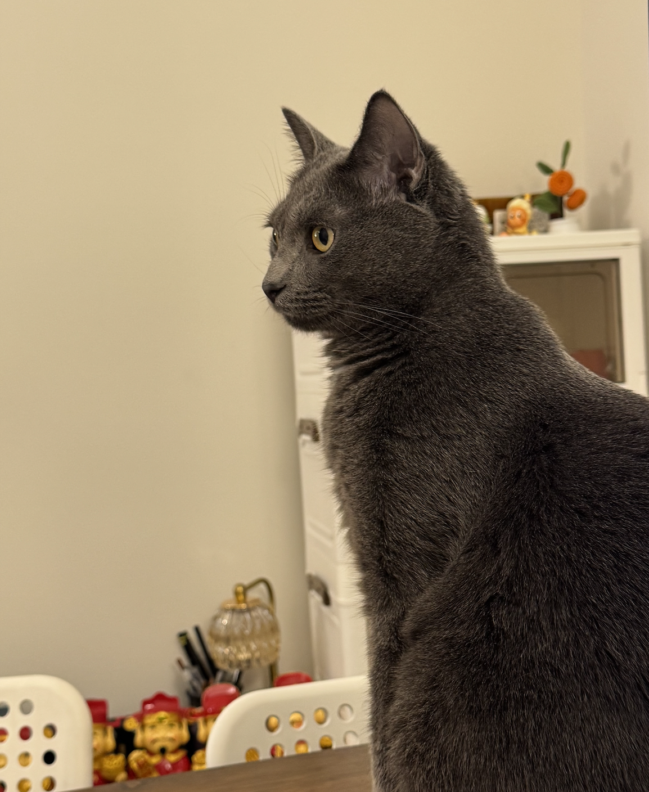
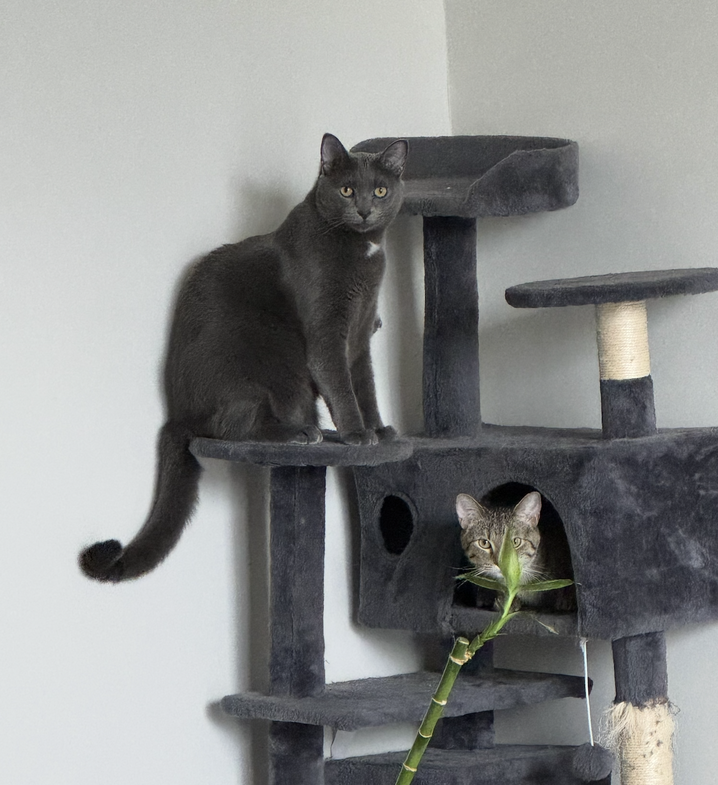
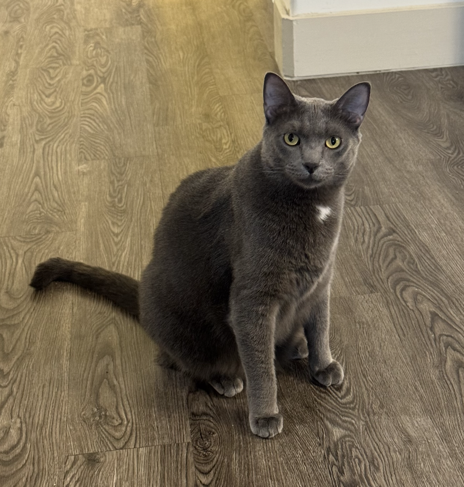
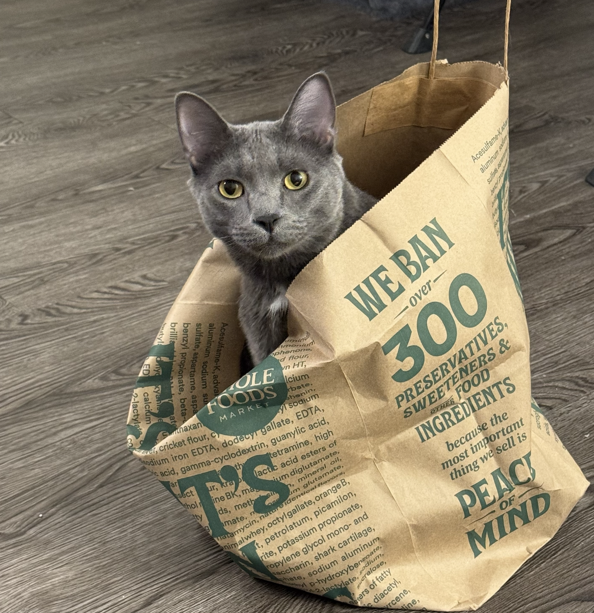
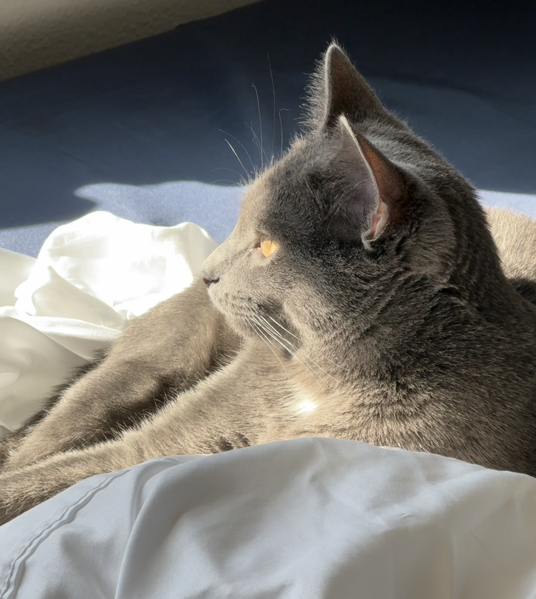
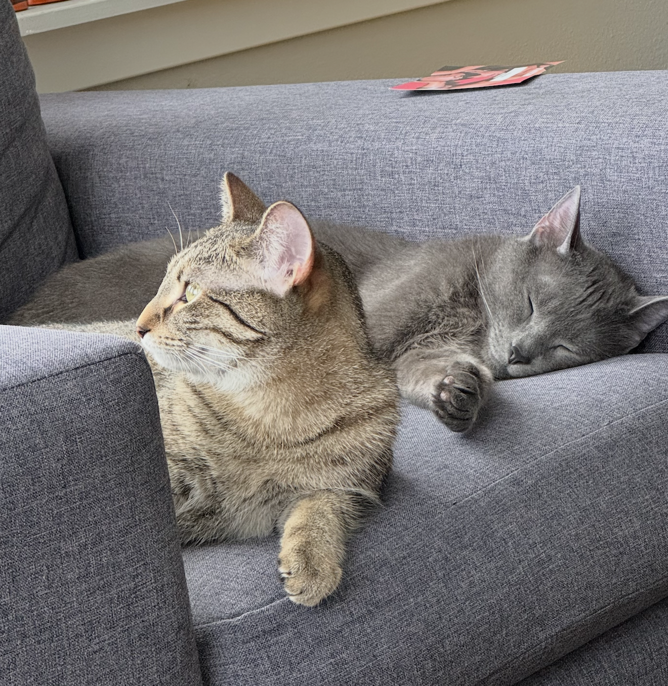
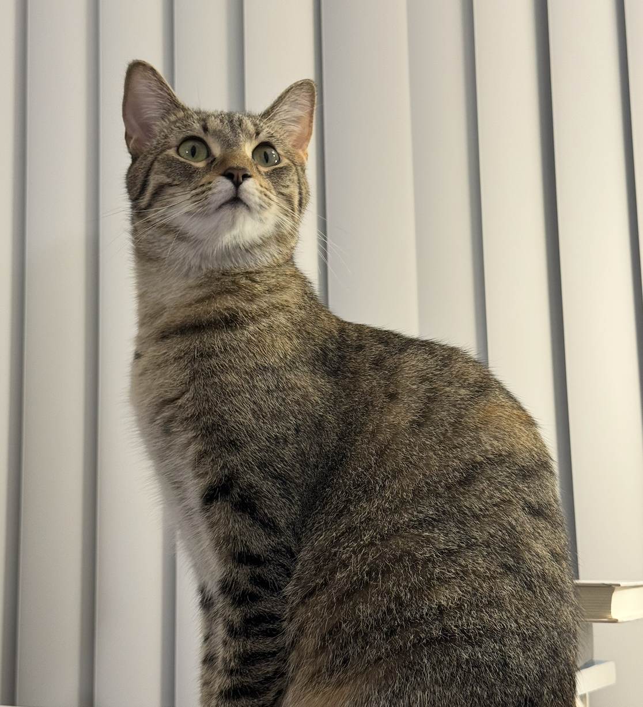

I have two lovely cats — Tutu, a gentle boy, and Naonao, a sweet girl. They’re more than pets; they’re my little family. They’ve stayed by my side through everyday moments and life’s brightest milestones, witnessing my journey. I love them with all my heart.

    
    
    
    
    
    
    
    

